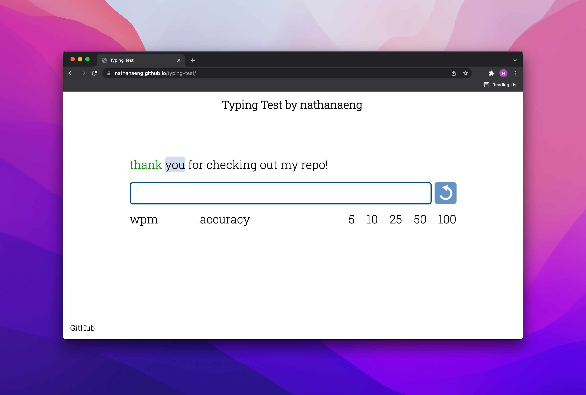

# [Typing Test](https://nathanaeng.github.io/typing-test/) in JavaScript
Over the summer, I made it my goal to learn how to type faster. There are lots of great websites out there (like [10fastfingers](https://10fastfingers.com/), [typingtest.com](https://www.typingtest.com/), and [typings.gg](https://typings.gg/)), but I figured I might as well practice coding at the same time - so I implemented my own typing test! This typing test combines features from each of these websites. Find out how many words per minute you can type!

This project builds upon my [last](https://github.com/nathanaeng/typing-test-CLI) typing test project which is meant to run in the terminal. Unlike that project, this version runs on a website: https://nathanaeng.github.io/typing-test/ (formatted for desktops). This repository contains the source code.

----
## User Guide
1. Click the center text box and start typing to automatically start the timer.
2. If the text box is highlighted red, it means that the word has been typed incorrectly.
3. Press `delete` to delete a character.
4. Once the `space` character is pressed, you will be unable to edit the last word.
5. Once the typing test is over, your WPM (words per minute) and accuracy will be displayed.
6. Click the refresh button or reload the page to reset the typing test.
7. Click one of the numbers on the right to change the number of words in the typing test - the larger the number, the more accurate the test will be.

## Technicalities
The typing test is terminated automatically if the last word typed is correct. Otherwise, the typing test is terminated with a space character.

Words are case sensitive.

Words typed incorrectly will be not be factored into the WPM calculation.

Accuracy is calculated per word, not per character. Suppose there are 4 words with 20 characters total. Even if you only mistype 1 character, your accuracy will be 75% (3/4) and not 95% (19/20).

The default length of the typing test is 10 words. However, after a person has changed this setting, their most recent choice will be remembered until they clear their cache.

## Changes From Last Project
Some quality of life changes have been made since the last project. Some of these are also personal taste.
- Unlike the original typing test designed in C, this typing test does not allow for the user to change a word after `space` is pressed. This creates a cleaner overall look.
- The words list has been updated.
- WPM is now reported as an integer rather than a float.
